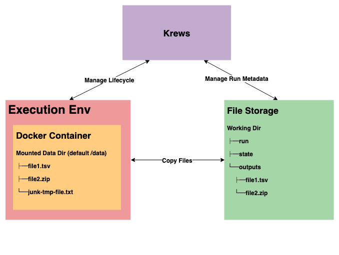

# Docker

Docker is a program for building and running software packages called 
[containers](https://en.wikipedia.org/wiki/Container_(virtualization)). Containers are a great way of making sure your 
code runs the same way everywhere without worrying about installing or configuring anything. For this reason Krews 
uses docker containers for everything. Krews does not even attempt to without containers, nor are there plans to try 
in the future.

## How Krews uses Docker

    

Krews runs each task in separate Docker containers. Each execution environment has different ways of 
running and accessing docker containers and different ways of storing workflow files (state, results, logs, etc...)
but running a task typically looks like this:

- A directory is created that will be [mounted](https://docs.docker.com/storage/volumes/) inside a docker container 
(to /data by default)
- Files are copied into this directory from file storage
- Krews executes the docker container with a specified command.
- Metadata about the run is updated and stored in the background.
- Krews polls until the command execution is complete.
- Files are copied out of the mounted directory back to File Storage

### File Storage

File Storage and the methods that files are copied vary per execution environment. For example, the 
Google executor keeps data in [Google Cloud Storage](https://cloud.google.com/storage/) whereas the Slurm executor
relies on an NFS that available to all worker nodes.

## What about Singularity?

The Krews Slurm executor uses Singularity to run docker containers. Krews does not support singularity containers.