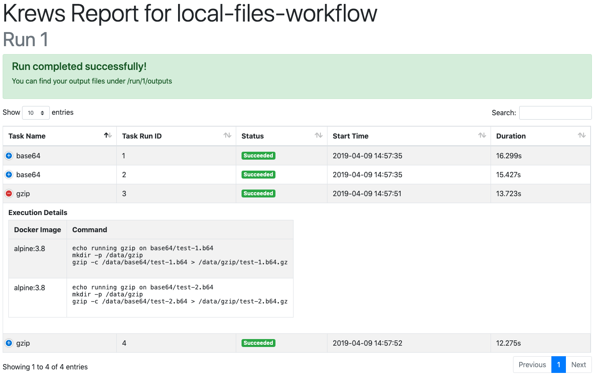

# Output and State

## Avoiding Repeats

Tasks can often be expensive, so we don't want to repeat them if we don't need to. That's why every time we 
execute a task run, we first check if all the output files already exist in the `outputs/` directory. If they do,
that run gets skipped.

In the cases where output files are marked as optional, a special `.none` file will be checked instead. These files 
get created if a task run is successful, but an optional output file is not found.

## Reports

As tasks are run, you can go into your working directory and find your status/report.html file. It will contain 
information on every task that was run, including whether it completed successfully, in error, or is still in 
progress.

    

## Workflow Output Layout

Although each execution environment stores files differently, the way they layout outputs for the workflow is 
mostly the same.

The the top level in the working directory (provided in config) we have the following

    

- `outputs/` contains files created by our tasks.
- `run/` contains all files related to a single run.

Each output run directory looks like the following

    

- `bin/` contains the Krews workflow executable and configuration used for this run.
- `status/` contains an html report on the status of this run.
- `logs/` contains logs for each task and the Krews application itself, if run remotely in Google Cloud.

    

