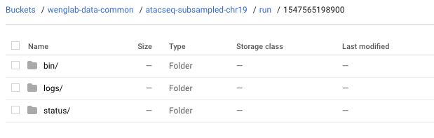

# Output and State

## Workflow Output Layout

Although each execution environment stores files differently, the way they layout outputs for the workflow is 
mostly the same.

The the top level in the working directory (provided in config) we have the following

    

- `outputs/` contains files created by our tasks.
- `state/` contains a file with our cache data.
- `output/` contains all files related to a single run. 

Each output run directory looks like the following

    

- `bin/` contains the Krews workflow executable and configuration used for this run.
- `status/` contains an html report on the status of this run.
- `logs/` contains logs for each task and the Krews application itself, if run remotely in Google Cloud.

    

## State

State is tracked internally with an SQLite file database. This is periodically copied into your
working directory under state/metadata.db. This file should NOT be deleted if you want to make full use of caching.

## Caching

Tasks can often be expensive, so we don't want to repeat them if we don't need to. That's where caching comes in.

For every file created by a task run found in the "outputs" directory, we save the following data 
related to the file and task runs that created it:

- File path
- File last modified time (for tracking changes)
- Task name
- Docker Image
- Command
- Inputs (as JSON)
- Params (as JSON) 

For each task run, if these fields match was we have saved and the file still exists in the outputs directory 
with the same last modified time, we skip the running the task.

## Reports

As tasks are run, you can go into your working directory and find your status/report.html file.

    

It will contain information on every task that was run, including whether it completed successfully, in error, or 
is still in progress.

    

